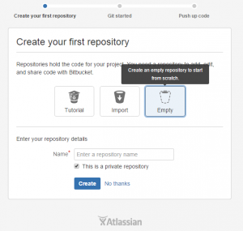
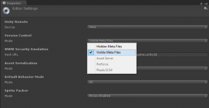
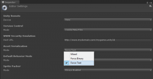
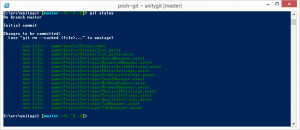

We’ve started using Git for our Unity3D projects and this tutorial describes the best way to set up a Unity3D project to use Git for source control as well as some best practices. In the past we’ve used SVN and Mercurial as well and so far we’ve found Git to be the best option. The main advantages of using Git with Unity are:

1. Distributed development allowing offline work when on the road or otherwise disconnected from the internet
2. A number of GUI clients
3. Cross platform support

The main disadvantages of Git are:

1. Not specifically supported by Unity, however it works without an issue
2. Not great for large files
3. Can be complex for some team members

I’ll just jump straight into the steps for getting yourself set up with Git. You have two options for creating a Git account, [GitHub](https://github.com/) and [BitBucket](https://bitbucket.org/). For a more comprehensive tutorial on the git commands, check out the[Git tutorial](https://try.github.io/levels/1/challenges/1). This tutorial will use BitBucket as you can create a free private repository, however everything after the first 2 steps are the same if you use GitHub.

**Getting Started**

1. Create a BitBucket account if you don’t have one – [https://bitbucket.org/](https://bitbucket.org/)
2. Create a new repository on BitBucket 1. After signing up you are automatically taken to the create repository screen. If you missed this, you can just click the “Create” button at any time within the BitBucket header to create a new repository
3. Choose “Empty” repository and give it a name
4. You will be prompted to download [SourceTree](https://www.atlassian.com/software/sourcetree/overview) or to [Install Git](https://confluence.atlassian.com/x/qQaWFw). For this tutorial will will use the command line version of Git, SourceTree is a great option if you don’t like using the command line
5. 

    

6. Set up your local directory 1. Drop into a command window on your platform (I use powershell on Windows)
7. Create a new directory for your project (**mkdir /path/to/your/project**)
8. Go to the new directory (**cd /path/to/your/project**)
9. Initialize git (**git init**)
10. Add the new remote repository (**git remote add origin [https://@bitbucket.org//.git](https://%3Cusername%3E@bitbucket.org/%3Cprojectname%3E/%3Cprojectname%3E.git)**) 1. This copies the remote repository (sitting on bitbucket) down to your local machine
11. From here you make changes to the source and push back up to the server once finished
12. Create a new Unity project in the project directory
13. Set up your Unity project to work with Git (or any source control) 1. Navigate to Edit -> Project Settings -> Editor
14. Change Version Control Mode to **Visible Meta Files**
15. 

    

16. Change Asset Serialization Mode to** Force Text**
17. 

    

18. Save the current scene of your game
19. Close Unity
20. Update your gitignore_global.txt file to ignore unwanted Unity files 1. Unity has a bunch of files we don’t want to check into source control. Copy the lines from the[following file](https://github.com/github/gitignore/blob/master/Unity.gitignore) into your gitignore_global.txt file to ignore these unwated files.
21. The only directories you need to have source controlled for a Unity project are Assets and ProjectSettings. Unity has done a great job of separating all the temporary files out into their own directories.
22. The global ignore file is used across all git projects and saves you ignoring the same files each time you start a new Unity project. This file is combined with project specific ignore files (see below) to determine the full ignore list
23. Add the new files to your local repository (**git add .**) 1. The period (.) at the end of the line adds all files
24. This tells git you want to include the added files in the commit
25. Check that the files have been successfully added (**git status**) 1. You should see about 16 files
26. If you see more, check that you have set up you gitignore_global.txt file correctly
27. 

    

28. Commit the changes to your local repository (**git commit -m “Initial Commit with empty project”**) 1. The -m switch lets you supply a message to your commit. These should be clear and concise
29. The changes are now committed to your local repository, next we will push them up to the server
30. These changes are not yet up on the server
31. Push the changes to the BitBucket server (**git push -u origin master**) 1. Enter your password
32. The -u origin master parameters let bitbucket know where to push these changes. From now on you will only need to call git push to push changes
33. This pushes your local repository (that you commited in step 11) up to the server. Note that any changes in your working directory will not be pushed to the server

You

We’ve started using Git for our Unity3D projects and this tutorial describes the best way to set up a Unity3D project to use Git for source control as well as some best practices. In the past we’ve used SVN and Mercurial as well and so far we’ve found Git to be the best option. The main advantages of using Git with Unity are:

1. Distributed development allowing offline work when on the road or otherwise disconnected from the internet
2. A number of GUI clients
3. Cross platform support

The main disadvantages of Git are:

1. Not specifically supported by Unity, however it works without an issue
2. Not great for large files
3. Can be complex for some team members

I’ll just jump straight into the steps for getting yourself set up with Git. You have two options for creating a Git account, [GitHub](https://github.com/) and [BitBucket](https://bitbucket.org/). For a more comprehensive tutorial on the git commands, check out the[Git tutorial](https://try.github.io/levels/1/challenges/1). This tutorial will use BitBucket as you can create a free private repository, however everything after the first 2 steps are the same if you use GitHub.

**Getting Started**

1. Create a BitBucket account if you don’t have one – [https://bitbucket.org/](https://bitbucket.org/)
2. Create a new repository on BitBucket 1. After signing up you are automatically taken to the create repository screen. If you missed this, you can just click the “Create” button at any time within the BitBucket header to create a new repository
3. Choose “Empty” repository and give it a name
4. You will be prompted to download [SourceTree](https://www.atlassian.com/software/sourcetree/overview) or to [Install Git](https://confluence.atlassian.com/x/qQaWFw). For this tutorial will will use the command line version of Git, SourceTree is a great option if you don’t like using the command line
5. Set up your local directory 1. Drop into a command window on your platform (I use powershell on Windows)
6. Create a new directory for your project (**mkdir /path/to/your/project**)
7. Go to the new directory (**cd /path/to/your/project**)
8. Initialize git (**git init**)
9. Add the new remote repository (**git remote add origin [https://@bitbucket.org//.git](https://%3Cusername%3E@bitbucket.org/%3Cprojectname%3E/%3Cprojectname%3E.git)**) 1. This copies the remote repository (sitting on bitbucket) down to your local machine
10. From here you make changes to the source and push back up to the server once finished
11. Create a new Unity project in the project directory
12. Set up your Unity project to work with Git (or any source control) 1. Navigate to Edit -> Project Settings -> Editor
13. Change Version Control Mode to **Visible Meta Files**
14. Change Asset Serialization Mode to** Force Text**
15. Save the current scene of your game
16. Close Unity
17. Update your gitignore_global.txt file to ignore unwanted Unity files 1. Unity has a bunch of files we don’t want to check into source control. Copy the lines from the[following file](https://github.com/github/gitignore/blob/master/Unity.gitignore) into your gitignore_global.txt file to ignore these unwated files.
18. The only directories you need to have source controlled for a Unity project are Assets and ProjectSettings. Unity has done a great job of separating all the temporary files out into their own directories.
19. The global ignore file is used across all git projects and saves you ignoring the same files each time you start a new Unity project. This file is combined with project specific ignore files (see below) to determine the full ignore list
20. Add the new files to your local repository (**git add .**) 1. The period (.) at the end of the line adds all files
21. This tells git you want to include the added files in the commit
22. Check that the files have been successfully added (**git status**) 1. You should see about 16 files
23. If you see more, check that you have set up you gitignore_global.txt file correctly
24. Commit the changes to your local repository (**git commit -m “Initial Commit with empty project”**) 1. The -m switch lets you supply a message to your commit. These should be clear and concise
25. The changes are now committed to your local repository, next we will push them up to the server
26. These changes are not yet up on the server
27. Push the changes to the BitBucket server (**git push -u origin master**) 1. Enter your password
28. The -u origin master parameters let bitbucket know where to push these changes. From now on you will only need to call git push to push changes
29. This pushes your local repository (that you commited in step 11) up to the server. Note that any changes in your working directory will not be pushed to the server

You’re now set up with Git for your Unity project. Below is an overview of the different parts of git:

- Working directory – this is your local file system containing your Unity files. This is basically your src tree as it was before source control (with a hidden .git directory that stores all of the git related stuff, Unity ignores this folder)
- Local repository – Think of this as a local copy of the source tree with all the changes that have ever been made to the project. This resides on your local PC and can be committed to independently of the server repository
- Server repository – This is the server copy of the source tree that is shared between all the users of the project. Changes from each developer are pushed up from their local repository into this shared repository (that sits on BitBucket in this example but can be anywhere).

**Below are common commands you will use**

- To pull changes from other team members - **git pull**
- To commit further changes - **git commit -m “”**
- To push more changes to the server - **git push**
- To see which files are in your working copy (which files have changed locally that have not been commited) - **git status**
- To add new files to a commit - **git add .**
- To add a specific file to a commit - **git add**
- To ignore project specific files
- Create a .gitignore file (**touch .gitignore**)
- Add the files to be ignored to .gitignore
- Add .gitignore to the commit (**git add .gitignore**)
- View changes made in the working directory (**git diff**) - I highly recommend a tool like Araxis Merge or similar for powerful diff and merging
- Revert local to latest commit (**git checkout — .**) - If you’re working and decide you want to revert the work you’ve done to the previous commit
- Make sure you remember to period (.) at the end
- Not this won’t remove added files, it simply reverts modifications (and deletions) to the previous commit

**Some thoughts on workflow**

1. One of the only major downsides to Git (or any distributed source control) is the inability to lock files so multiple users can’t edit them at the same time. Unity’s “force text” option minimizes these problems, however there can still be conflicts if you have multiple poeple working on the same files, especially .scene files. There are a few options to get around this: 1. Only have one person working on a particular scene file at a time
2. Use prefabs for storing game objects rather than scene files. This is a good practice anyway
3. Get a good diff tool
4. The other downside of Git is that large file can bloat your repository size. For this reason we tend to have our artists and audio director work in Dropbox while working on their files and we only bring completed versions into the repository and Unity project.
5. We use branching for different features/versions of the game, especially supporting multiple platforms. We tend to keep all of our platforms in the main development branch and as we approach a release we create a branch for each platform to create platform specific code and speed up making small platform specific fixes. A great article on branching in git can be found [here](http://nvie.com/posts/a-successful-git-branching-model/). After release we merge the branches together and continue working in the single main development branch.

I highly recommend checking out Unity Cloud Build for doing continuous integration with Unity. If supports Git and every time you push code to the server the Unity Cloud Build servers will automatically pull this code and make a new build. It currently supports Android, iOS and the WebPlayer.

1. While Git and source control in general can be daunting to non-technical people on the team it is definitely worth getting everyone up to speed. GUI based clients like SourceTree allow an easier transition to source control, however it’s still good for everyone to have a solid understanding of the underlying principles of Git (or any source control you are using).
2. If you’re on windows using Powershell then I recommend installing PoshGit. You can get some instructions [here](http://www.imtraum.com/blog/streamline-git-with-powershell/).

**Conclusion**

Please let me know what you think of this tutorial and if I’ve made any mistakes or missed anything out. I tried to keep the tutorial as pragmatic as possible, covering the most common usage of Git. See the links throughout the article for some deep dives into different aspects of Git. What source control are you using? What are your best practices for Git (or any source control) and Unity?

re now set up with Git for your Unity project. Below is an overview of the different parts of git:

- Working directory – this is your local file system containing your Unity files. This is basically your src tree as it was before source control (with a hidden .git directory that stores all of the git related stuff, Unity ignores this folder)
- Local repository – Think of this as a local copy of the source tree with all the changes that have ever been made to the project. This resides on your local PC and can be committed to independently of the server repository
- Server repository – This is the server copy of the source tree that is shared between all the users of the project. Changes from each developer are pushed up from their local repository into this shared repository (that sits on BitBucket in this example but can be anywhere).

**Below are common commands you will use**

- To pull changes from other team members - **git pull**
- To commit further changes - **git commit -m “”**
- To push more changes to the server - **git push**
- To see which files are in your working copy (which files have changed locally that have not been commited) - **git status**
- To add new files to a commit - **git add .**
- To add a specific file to a commit - **git add**
- To ignore project specific files
- Create a .gitignore file (**touch .gitignore**)
- Add the files to be ignored to .gitignore
- Add .gitignore to the commit (**git add .gitignore**)
- View changes made in the working directory (**git diff**) - I highly recommend a tool like Araxis Merge or similar for powerful diff and merging
- Revert local to latest commit (**git checkout — .**) - If you’re working and decide you want to revert the work you’ve done to the previous commit
- Make sure you remember to period (.) at the end
- Not this won’t remove added files, it simply reverts modifications (and deletions) to the previous commit

**Some thoughts on workflow**

1. One of the only major downsides to Git (or any distributed source control) is the inability to lock files so multiple users can’t edit them at the same time. Unity’s “force text” option minimizes these problems, however there can still be conflicts if you have multiple poeple working on the same files, especially .scene files. There are a few options to get around this: 1. Only have one person working on a particular scene file at a time
2. Use prefabs for storing game objects rather than scene files. This is a good practice anyway
3. Get a good diff tool
4. The other downside of Git is that large file can bloat your repository size. For this reason we tend to have our artists and audio director work in Dropbox while working on their files and we only bring completed versions into the repository and Unity project.
5. We use branching for different features/versions of the game, especially supporting multiple platforms. We tend to keep all of our platforms in the main development branch and as we approach a release we create a branch for each platform to create platform specific code and speed up making small platform specific fixes. A great article on branching in git can be found [here](http://nvie.com/posts/a-successful-git-branching-model/). After release we merge the branches together and continue working in the single main development branch.
6. I highly recommend checking out Unity Cloud Build for doing continuous integration with Unity. If supports Git and every time you push code to the server the Unity Cloud Build servers will automatically pull this code and make a new build. It currently supports Android, iOS and the WebPlayer.
7. While Git and source control in general can be daunting to non-technical people on the team it is definitely worth getting everyone up to speed. GUI based clients like SourceTree allow an easier transition to source control, however it’s still good for everyone to have a solid understanding of the underlying principles of Git (or any source control you are using).
8. If you’re on windows using Powershell then I recommend installing PoshGit. You can get some instructions [here](http://www.imtraum.com/blog/streamline-git-with-powershell/).

**Conclusion**

Please let me know what you think of this tutorial and if I’ve made any mistakes or missed anything out. I tried to keep the tutorial as pragmatic as possible, covering the most common usage of Git. See the links throughout the article for some deep dives into different aspects of Git. What source control are you using? What are your best practices for Git (or any source control) and Unity?
